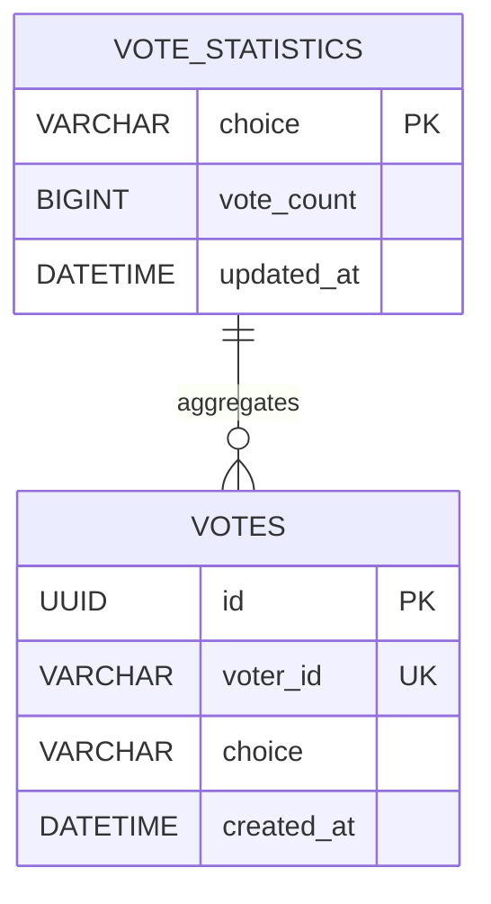

# Implementation Notes

요구사항을 코드로 옮기기 위한 구현 메모를 정리한다. 라이브 테스트 중에는
단순하고 검증 가능한 구현 순서를 우선한다.

## Domain And Package Plan

소유 도메인:

- `vote`: 짜장면/짬뽕 투표 등록과 결과 집계를 소유한다.

필요한 패키지:

- [x] `presentation`: 투표 등록/결과 조회/health check controller, request/response DTO
- [x] `service`: 투표 등록 use case, 결과 집계 use case
- [x] `repository`: `Vote` 저장과 `VoteStatistic` 조회/갱신 query
- [x] `domain`: `Vote` entity, `VoteStatistic` entity, `VoteChoice` enum

새 패키지를 만들면 `docs/templates/package-agents/`의 matching template을
각 layer 패키지에 `AGENTS.md`로 복사한다.

## ERD

`votes`는 개별 투표 원장으로 유지하고, `vote_statistics`는 결과 조회용 누적
통계 테이블로 사용한다. 통계 row는 `choice`별 1개씩 유지한다.



### `votes`

| Column | Type | Constraint | Description |
| --- | --- | --- | --- |
| `id` | UUID | PK, not null | 투표 row 식별자 |
| `voter_id` | varchar(100) | not null, unique | `userId`와 같은 사용자 식별자, 중복 투표 방지 기준 |
| `choice` | varchar(20) | not null | `jajang` 또는 `jjamppong` |
| `created_at` | datetime | not null | 투표 생성 시각 |

제약과 인덱스:

- Primary key: `id`
- Unique key: `voter_id`
- Index: `choice`

### `vote_statistics`

| Column | Type | Constraint | Description |
| --- | --- | --- | --- |
| `choice` | varchar(20) | PK, not null | `jajang` 또는 `jjamppong` |
| `vote_count` | bigint | not null | 해당 선택지의 누적 투표 수 |
| `updated_at` | datetime | not null | 통계 row 마지막 갱신 시각 |

초기 row:

- `choice = 'jajang'`, `vote_count = 0`
- `choice = 'jjamppong'`, `vote_count = 0`

## Implementation Flow

1. 요구사항과 API 계약을 정리한다.
2. `Vote`, `VoteStatistic` entity와 `VoteChoice` enum을 추가한다.
3. `VoteRepository`에 저장/count query를 추가하고, 통계 repository에 조회/저장 query를 추가한다.
4. `VoteService`에서 투표 등록과 통계 기반 결과 조회 use case를 구현한다.
5. `VoteController`에서 `POST /api/vote`, `GET /api/result`를 제공한다.
6. `GET /health`를 제공한다.
7. OpenAPI, README, 테스트를 갱신한다.

## Data Flow

```text
POST /api/vote
  -> VoteController
  -> VoteService
  -> VoteRepository.findByVoterId(voterId) with PESSIMISTIC_WRITE
  -> VoteRepository.save(Vote)
  -> votes

VoteStatisticsScheduler, every 10 minutes
  -> VoteStatisticsService.refreshStatistics()
  -> VoteRepository.countByChoice(...)
  -> VoteStatisticRepository.save(...)
  -> vote_statistics

GET /api/result
  -> VoteController
  -> VoteStatisticsService
  -> VoteStatisticRepository.findAll()
  -> vote_statistics
```

투표 등록 주요 분기:

- `choice` 또는 `voterId`가 누락/blank/허용되지 않은 값이면 validation 오류로 처리한다.
- `voterId`는 이 서비스의 `userId`와 같은 값으로 취급한다.
- `voterId`로 기존 `votes` row를 비관적 쓰기 락으로 조회한다.
- 기존 row가 있으면 이미 투표한 사용자로 보고 `409 Conflict`를 반환한다.
- 정상 요청이면 `votes`에 저장한다.
- 아직 row가 없는 `voterId`의 동시 insert 경쟁은 `voter_id` unique constraint 위반을 `409 Conflict`로 변환한다.
- 투표 API transaction에서는 `vote_statistics`를 변경하지 않는다.

통계 갱신 주요 분기:

- 10분마다 스케줄러가 `votes`의 `choice`별 count를 조회한다.
- `vote_statistics`에 `jajang`, `jjamppong` row가 없으면 생성한다.
- 각 통계 row의 `vote_count`를 현재 `votes` 집계값으로 덮어쓴다.

결과 조회 집계 기준:

- `jajang`: `vote_statistics.choice = 'jajang'` row의 `vote_count`
- `jjamppong`: `vote_statistics.choice = 'jjamppong'` row의 `vote_count`
- `total`: `jajang + jjamppong`

## Transaction And Persistence

- 투표 등록은 하나의 write transaction 안에서 `votes` insert를 수행한다.
- 이미 존재하는 `voterId`는 `votes` row를 `PESSIMISTIC_WRITE`로 잠근 뒤 중복을 판단한다.
- 아직 row가 없는 `voterId`는 잠글 대상이 없으므로 `votes.voter_id` unique key를 최종 방어선으로 둔다.
- 같은 `voterId`로 동시 신규 요청이 들어오면 하나만 insert 성공하고 나머지는 conflict 오류로 처리한다.
- 투표 저장과 `vote_statistics` 갱신은 같은 transaction으로 묶지 않는다.
- 통계 갱신은 10분마다 별도 scheduler transaction에서 `votes` 기준으로 재계산한다.
- 결과 조회는 read-only transaction으로 통계 row를 조회한다.
- 재시작 후 데이터 유지는 MySQL 등 영속 저장소와 Docker volume 또는 외부 DB 연결로 보장한다.

## Test Scenarios

API/integration:

- `POST /api/vote`가 정상 요청을 저장하고 성공 응답을 반환한다.
- `POST /api/vote`가 누락된 `choice`, 누락된 `voterId`, blank `voterId`, 잘못된 `choice`를 거절한다.
- 같은 `voterId`로 두 번 투표하면 두 번째 요청은 `409 Conflict`가 된다.
- 같은 `voterId`로 이미 저장된 row가 있으면 비관적 락 조회 이후 `409 Conflict`가 된다.
- 같은 `voterId` 신규 동시 요청은 하나만 성공하고 나머지는 unique constraint 기반 conflict가 된다.
- 투표 성공 직후에는 통계 테이블이 즉시 증가하지 않는다.
- 스케줄러 실행 후 통계 테이블이 `votes`의 `choice`별 count와 일치한다.
- `GET /api/result`가 통계 테이블 기준 `jajang`, `jjamppong`, `total`을 반환한다.
- `GET /health`가 정상 상태에서 `200 OK`를 반환한다.

Service/domain:

- `VoteChoice`는 `jajang`, `jjamppong`만 허용한다.
- `Vote`는 생성 시 `id`, `voterId`, `choice`, `createdAt`을 가진다.
- `VoteStatistic`은 `choice`, `voteCount`, `updatedAt`을 가지며 음수 카운트를 허용하지 않는다.
- 중복 `voterId` 저장 실패가 도메인 conflict로 변환된다.

## Deferred Improvements

- 대량 트래픽으로 통계 row update가 병목이 되면 캐시, 샤딩된 카운터, 비동기 집계를 검토한다.
- 투표 수정/삭제, 후보 확장, 설문 종료 시간은 현재 요구사항 밖이다.
- 인증/인가와 사용자 테이블 연동은 현재 요구사항 밖이다.
